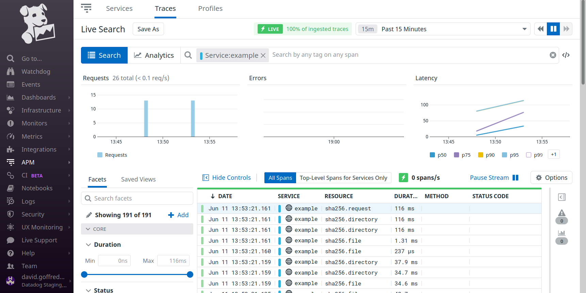
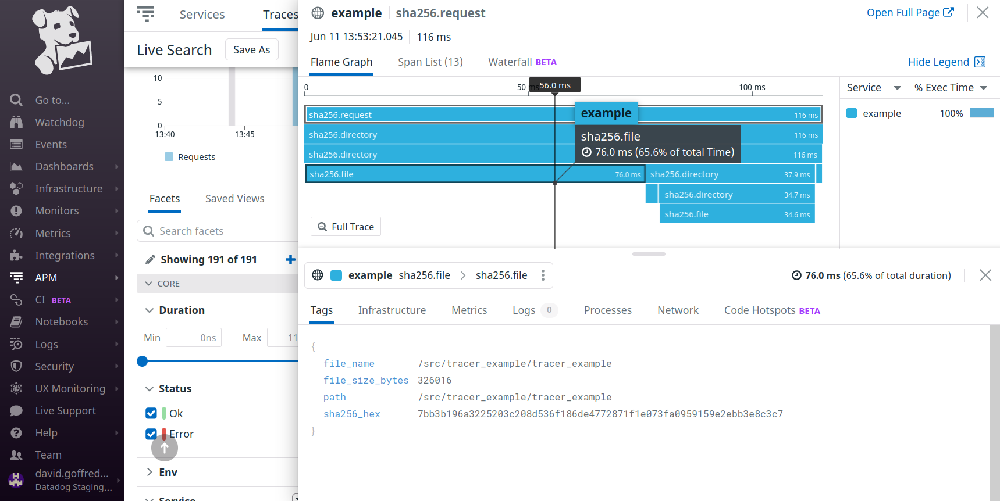

> [!WARNING]
> Datadog OpenTracing for C++ is deprecated. Please use [dd-trace-cpp](https://github.com/DataDog/dd-trace-cpp/tree/main).

C++ Example
===========
Here's an example of using Datadog's OpenTracing implementation to add tracing
to a C++ application.

The example application is an interactive command line tool that calculates the
SHA256 digest of a specified directory by walking the file system and combining
the digests of all descendant regular files.

The source code of the example is [src/tracer_example.cpp][3].

Usage
-----
The script [bin/build-and-run-example.sh][1] uses [docker-compose][2] to build
two Docker images:

<dl>
  <dt>dd-agent</dt>
  <dd>The Datadog Agent, from <a href="https://hub.docker.com/r/datadog/agent">datadog/agent</a> on Docker Hub.</dd>

  <dt>dd-opentracing-cpp-example</dt>
  <dd>Example command line tool that calculates checksums and emits traces.</dd>
</dl>

After building the images, the script starts two containers using the built
images and attaches the invoking shell to the running command line example
tool.

When the command line tool exits, `docker-compose` brings down the containers.

### Example
```console
$ bin/build_and_run_example.sh 
Please set environment variable DD_API_KEY.

$ DD_API_KEY=[... your key ...] bin/build_and_run_example.sh
[... output from the build ...]
[...]
Starting dd-opentracing-cpp-example_dd-agent_1 ... done
Starting dd-opentracing-cpp-example_dd-opentracing-cpp-example_1 ... done
enter a file or directory (ctrl+d to quit): /var/log
sha256("/var/log"): 9eb02e49e8cb0e307bbd0a99eee74257a1e058f69b492fc7c134846c46d03e32
enter a file or directory (ctrl+d to quit): /src
sha256("/src"): fc8587eff2d64d0d7290b9a6c158793bb4b781123e2d20f4fd7e881aa72c1029
enter a file or directory (ctrl+d to quit): ^d
Shutting down in 3... 2... 1... here we go!
Stopping dd-opentracing-cpp-example_dd-agent_1 ... done
Removing dd-opentracing-cpp-example_dd-opentracing-cpp-example_1 ... done
Removing dd-opentracing-cpp-example_dd-agent_1                   ... done
Removing network dd-opentracing-cpp-example_default

$
```

Take note of the lines
```
enter a file or directory (ctrl+d to quit): /var/log
sha256("/var/log"): 9eb02e49e8cb0e307bbd0a99eee74257a1e058f69b492fc7c134846c46d03e32
enter a file or directory (ctrl+d to quit): /src
sha256("/src"): fc8587eff2d64d0d7290b9a6c158793bb4b781123e2d20f4fd7e881aa72c1029
```

The example program will have produced a trace of its work calculating the
digests of all regular files under `/var/log` in the container, and a separate
trace for `/src`.  The trace's service name is `example`, and the toplevel
resource name is `sha256.request`, e.g.





Attribution
-----------
This example uses two header-only C++ libraries:

- [gulrak/filesystem][4], a C++11 backport of `std::filesystem`
- [okdshin/PicoSHA2][5], a C++98 implementation of the SHA256 hash function.

[1]: bin/build-and-run-example.sh
[2]: https://github.com/docker/compose
[3]: src/tracer_example.cpp
[4]: https://github.com/gulrak/filesystem
[5]: https://github.com/okdshin/PicoSHA2
